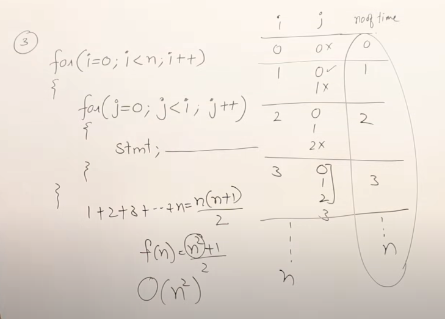
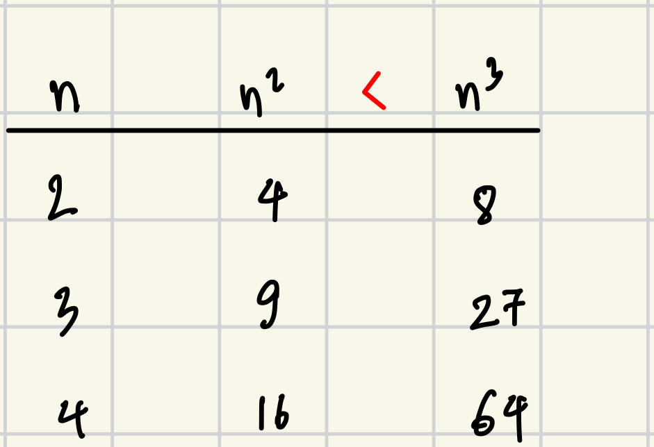

# Algorithms

## Algorithm vs Program
- Algorithms: 
	- Design
	- Domain knowledge
- Program:
	- Implementation.
	- ...

## Characteristic of Algorithms.

1. Input: One algorithm can take 0 or more inputs.
2. Output: At least 1 output.
3. Definiteness:  If human cannot solve the program $\implies$ should not ask computer solve it.
5. Finiteness: Should return at some point. Must have final statement.
6. Effectiveness: Should not *unnecessary statements*.

## How to write an Algorithm.

### Criteria for algorithm.
1. Time.
2. Space.
3. Network consumption
4. Power consumption.
5. CPU register.

```
swap (a,b) {
	temp = a;  -> 1
	a = b;     -> 1
	b = temp;  -> 1
}
		f(n)   -> 3 (constant)
```

## Frequency count method.

### 1. Example 1: Single loop
```
A = [8, 3, 9];

sum(A, n) { 					times
	s = 0; 						(1)
	for (i = 0; i < n; i++) {	(n + 1)
		  (1)    (n)    n
		s = s + A[i]; 			(n)
	}

	return s; 					(1)
} 	total: f(n) = 2n + 3 	=> O(n)
```

### 2. Example 2: Nested loops
```
											times
add(A, B, n) { 								(n + 1)
	for (i = 0; i < n; i++) {
		for (j = 0; j < n; j++) { 			(n) x (n + 1)
			c[i, j] = A[i, j] + B[i, j];	(n) x (n)
		}	
	}	
}				f(n) = 2n^2 + 2n + 1	 => O(n^2)
```

## Time complexity.
- Refer: 
	- https://www.reddit.com/r/computerscience/comments/s7h2vc/can_someone_explain_to_me_big_o_notation_like_im/
	- https://www.daniweb.com/programming/computer-science/threads/13488/time-complexity-of-algorithm


- Time complexity of an algorithm quantifies the amount of time taken by algorithm.



### P <= n
```
for (i = 1; P <= n; i++) {
	P = P + i;
}
```

For this we don't know what is $n$ value but we know loop stop at $P > n$

|  i  |          P          |
| :-: | :-----------------: |
|  1  |        0 + 1        |
|  2  |        1 + 2        |
|  3  |      1 + 2 + 3      |
|  k  | 1 + 2 + $\dots$ + k |
Assume P > n:
- $P = \frac{k(k+1)}{2}$
- $\frac{k(k + 1)}{2} > n \implies \text{the loop will stop}$
- $k^2 > n$
- $k > \sqrt{n}$
$\implies$ TC: $O(\sqrt{n})$

### i = i * 2

```
for (i = 1; i < n; i = i * 2) {
	// stmt	
}
```

|       i       |
| :-----------: |
|       1       |
|   1 x 2 = 2   |
|  2 x 2 = 2^2  |
| 2^2 x 2 = 2^2 |
|      2^k      |

Assume $i \ge n$
- $i = 2^k$
- $2^k \ge n$
- $2^k = n$
- $k = \log_{2}{n}$
$\implies O(\log_{2}{n})$

```
for(i = 1; i < n; i = i * 2) {
	// stmt	
}
```
$i = 1 \times 2 \times 2 \times  \dots = n$ 
$2^k = n \implies k = \log_{2}{n}$

- Sometime should take cell value of $\lceil log_{2}{n}\rceil$
### i <=n; i++
```
for(i = 1; i <= n; i++) {
	//stmt;
}
```

$i = 1 + 1 + \dots + 1 = n$ 
$\implies k = n$
### i = i / 2
```
for (i = n; i >= 1; i = i/2) {
	// stmt;
}
```

$\frac{i}{n} \rightarrow \frac{i}{2} \rightarrow \frac{i}{2^2} \rightarrow \frac{i}{2^k}$ 

Assume: $i < 1$
	$\frac{n}{2^k} < 1$
	$\frac{n}{2^k} = 1$
	$k = \log_2n$

### i * i < n
```
for (i = 0; i * i < n; i++) {
	//stmt;
}
```
$i * i < n$
Assume:  $i * i >= n$ (stop point)
	$i^2 =n$
	$i = \sqrt{n}$


### 2 loops

```
for (i = 0; i < n; i++) {
	//stmt					n
}

for (j = 0; j < n; j++) {
	//stmt 					n
}
							2n
							O(n) (total)
```


```
P = 0;

for (i = 0; i < n; i++) {
	P++; 					P = log(n)
}

for (j = 0; j < P; j++) {
	//stmt 					log(P)
							O(log(log(n)))
}
```

### Nested loop
```
for (i = 0; i < n; i++) { 			n	
	for (j = 1; j < n; j = j * 2) {	n * log(n)
		//stmt						n * log(n)
	}
}
									2nlog(n) + n
									O(nlog(n))
```

### Summary
1. `for (i = 0; i < n; i++)` 			: $O(n)$
2. `for (i = 0; i < n; i = i + 2)` 	: $\frac{n}{2} \Rightarrow O(n)$
3. `for (i = n; i > 1; i--)` 			: $O(n)$
4. `for (i = 1; i < n; i = i * 2)` 	: $O{\log_2n}$
5. `for (i = 1; i < n; i = i * 3)` 	: $O{\log_3n}$
6. `for (i = n; i > 1; i = i / 2)` 	: $O{\log_2n}$

### Analysis for while and if.

```
for i =1 to n do step 1 -> n + 1 {
	// stmt				   n
}
```

```
while(condition) { // pre check
	//stmt
}
```

```
do {
	//stmt
} while(condition) // post check
```

##### Analysis
```
i = 0; 					1
while (i < n) { 		n + 1
	// stmt				n	
	i++;				n	
}
						3n + 2
```

$\implies$ Simply like for but different way to calculate. Using assume technique.

## Type of time functions.

### Type.
- $O(1): \text{constant}$ 
- $O(\log{n}): \text{logrithemic}$ 
- $O(n): \text{linear}$ 
- $O(n^2): \text{quadratic}$ 
- $O(n^3): \text{cubic}$ 
- $O(2^n): \text{exponential}$ 
### Compare.

$1 < \log{n} < \sqrt{n} < n < n \cdot \log{n} < n^2< n^3 < n^n$

| $logn$ | $n$ | $n^2$ | $2^n$ |
| ------ | --- | ----- | ----- |
| 0      | 1   | 1     | 2     |
| 1      | 2   | 4     | 4     |
| 2      | 4   | 16    | 16    |
| 3      | 8   | 64    | 256   |
> Note:
> 	 $n^{100} < 2^n$
> 	 $n^k < 2^n$
## Asymptotic Notations Big Oh - Omega - Theta.
>Important

- Big-Oh $O$ : upper bound
- Omega $\Omega$ : lower bound
- Theta $\Theta$ : Average bound (*useful*)
### Big-Oh (upper bound)
>$\text{The function: }f(x) = O(g(n)) \iff \exists + \text{constants c and } n_0.$
> $\text{Such that: } f(n) \leq c \cdot g(n);\ \forall n \geq n_0$

eg: $f(n) = 2n + 3$
$2 \cdot n + 3 \leq 10 \cdot n\ (n \geq 1)$
- $f(n) = 2 \cdot n + 3$
- $c = 10$ just to  make sure the $c \cdot g(n) \geq f(n)$ 
- $g(n) = n$
$\therefore f(n) = O(n)$

- When write Big-Oh try to write closest function.
### Omega (lower bound)
> $\text{The function: } f(n) = \Omega(g(n)) \iff \exists \text{+ constants c and } n_0$
> $\text{Such that: } f(n) \geq c \cdot g(n);\ \forall n \geq n_0$

eg: $f(n) = 2n + 3$
$2 \cdot n + 3 \geq 1 \cdot n;\ \forall n \geq 1$
- $f(n) = 2 \cdot n + 3$
- $c = 1$ 
- $g(n) = n$
$\therefore f(n) = \Omega(n)$

### Theta (average bound)
> $\text{The function: } f(n) = \Theta(g(n)) \iff \exists + \text{ constants } c_1, c_2 \text{ and } n_0$
> $\text{Such that: } c_1 \cdot g(n) \leq f(n) \leq c_2 \cdot g(n);\ \forall n \geq n_0$

eg: $f(n) = 2n + 3$
 $1 \cdot n \leq 2 \cdot n + 3 \leq 10 \cdot n;\ \forall n \geq 1$
- $f(n) = 2 \cdot n + 3$
- $c_1 = 1$ 
- $c_2 = 10$ 
- $g(n) = n$
$\therefore f(n) = \Theta(n)$

> Can only use 1 value, there is only one. 

> Do not mix this with best case or worst case of algorithm.

This is just notation representing bound of a function.

### Example

1. $f(n) = 2n^2 + 3n + 4$

	$2n^2 + 3n + 4 \leq 2n^2 + 3n^2 + 4n^2$
	$2n^2 + 3n + 4 \leq 9n^2;\ n \geq 1$
	- $c = 9$
	- $g(n) = n^2$
	$\implies f(n) = O(n^2)$	

	$2n^2 + 3n + 4 \geq 1n^2$
	$\implies f(n) = \Omega(n^2)$	

	$1n^2 \leq 2n^2 + 3n + 4 \leq 9n^2$
	$\implies f(n) = \Theta(n^2)$	

2. $f(x)  = n^2log{n} + n$
	$1 \cdot n^2log{n} \leq n^2log{n} + n \leq 10  \cdot n^2log{n}$
	$\implies O(n^2log{n})$
	$\implies \Omega(n^2log{n})$
	$\implies \Theta(n^2log{n})$

3. $f(x)  = n!$
	$1 \leq n! \leq n^n$
	$\implies O(n^n)$
	$\implies \Omega(1)$
	
	- Cannot find the $\Theta$ since you cannot have something like:
		$n^{10} \leq n! \leq n^{11}$

3. $f(x)  = \log{n!}$

	$1 \leq log{n!} \leq log{n^n}$
	$1 \leq log{n!} \leq nlog{n}$
	$\implies \Omega(1)$
	$\implies O(nlog{n})$

> Big-Oh and Omega use when not sure about the exact one (Theta)
### Properties of Asymptotic Notations.
#### General Properties.
1. If $f(x)$ is $O(g(n))$ then $a \cdot f(n)$ is $O(g(n))$
	eg      : $f(n) = 2n^2 +5$ is $O(n^2)$
	then  : $7 \cdot f(n) = 7(2n^2 + 5)$
			    = $14n^2 + 35$ is $O(n^2)$
	
2. If $f(x)$ is $\Omega(g(n))$ then $a \cdot f(x)$ is $\Omega(g(n))$

3. If $f(x)$ is $\Theta(g(n))$ then $a \cdot f(x)$ is $\Theta(g(n))$
#### Reflexive
1. If $f(x)$ is given then $f(n)$ is $O(f(n))$
	eg  : $f(n) = n^2$ is $O(n^2)$ 

#### Transitive
1. If $f(n)$ is $O(g(n))$ and  $g(n)$ is $O(h(n))$
	$\implies$ $f(n) = O(h(n))$
	eg : $f(n) = n;\ g(n) = n^2;\ h(n) = n^3$ 
	- $n\ is\  O(n^2)$ 
	- $n^2\ is\  O(n^3)$ 
	$\boldsymbol{\Rightarrow n\ is\  O(n^3)}$ 
#### Symmetric

1. If $f(n)$ is $\Theta(g(n))$  then $g(n)$ is $\Theta(f(n))$ . True only for $\Theta$
	eg : $f(n) = n^2$; $g(n) = n^2$ 
	- $f(n) = \Theta(n^2)$
	- $g(n) = \Theta(n^2)$
#### Transpose Symmetric.
> True for $O$ and $\varOmega$ 

1. If $f(n) = O(g(n))$ then $g(n)  = \Omega(f(n))$
	eg: $f(n) = n;\ g(n) = n^2$
	$\Rightarrow$  $n: O(n^2)$ and  $n^2: \Omega(n)$

#### Extra
1. If $f(n) = O(g(n))$ and $f(n) = \Omega(g(n))$
	$g(n) \le f(n) \le g(n)$
	$\Rightarrow$ $f(n) = \Theta(g(n))$

2. If $f(n) = O(g(n))$ and $d(n) = O(e(n))$
	$\Rightarrow f(n) + d(n) = O(\max(g(n), e(n))$
	
	eg :	 $f(n) = n  = O(n)$
		$d(n) = n^2  = O(n^2)$
		$f(n) + d(n) = n + n^2 = O(n^2)$

3. If $f(n) = O(g(n))$ and $d(n) = O(e(n))$
	$\Rightarrow f(n) \cdot d(n) = O(g(n) \cdot e(n)$ 


## Comparison of functions

Suppose have 2 functions:
- $f(n) = n^2$
- $g(n) = n^3$

#### Sample data:


#### Log
- This method apply log on both side.
	$\log{n^2}$               $\log{n^3}$ 
	2$\log{n}$      $\lt$     $3\log{n}$ 

Revise log:
- $log(ab)  = \log{a} + \log{b}$
- $log(\frac{a}{b})  = \log{a} - \log{b}$
- $log(a^b)  = b\log{a}$
- $a^{log_c^b} = b^{log_c^a}$
- $a^b= n \Rightarrow b = \log_a^n$

https://www.youtube.com/watch?v=mwN18xfwNhk&list=PLDN4rrl48XKpZkf03iYFl-O29szjTrs_O&index=14&ab_channel=AbdulBari


